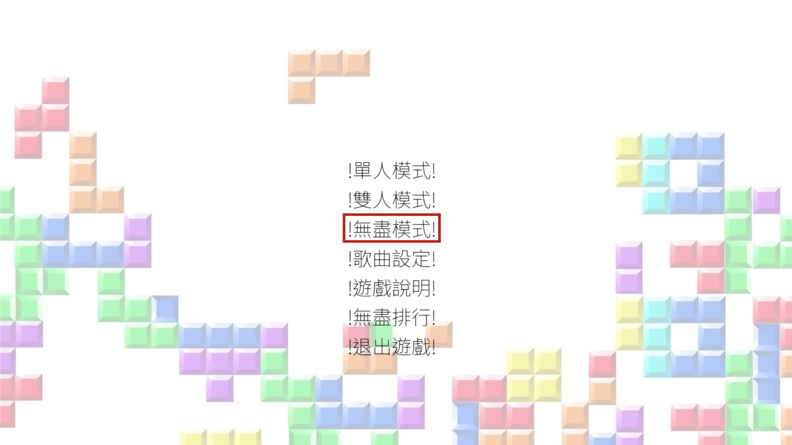
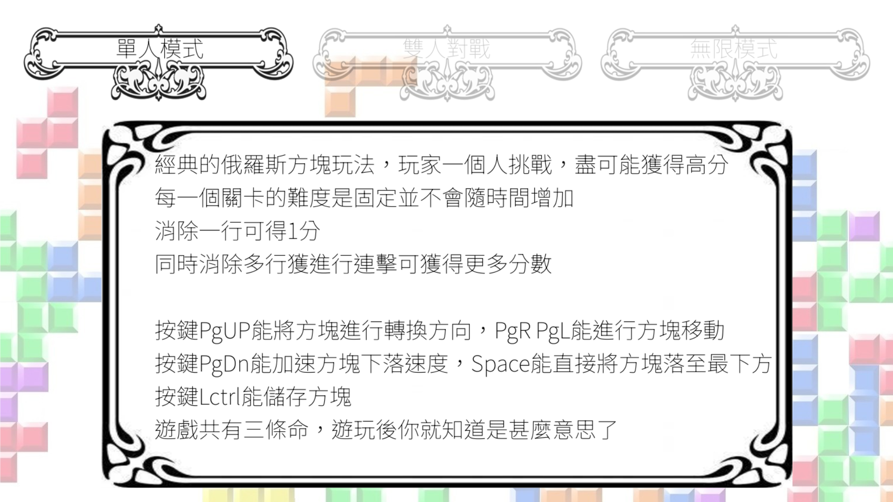
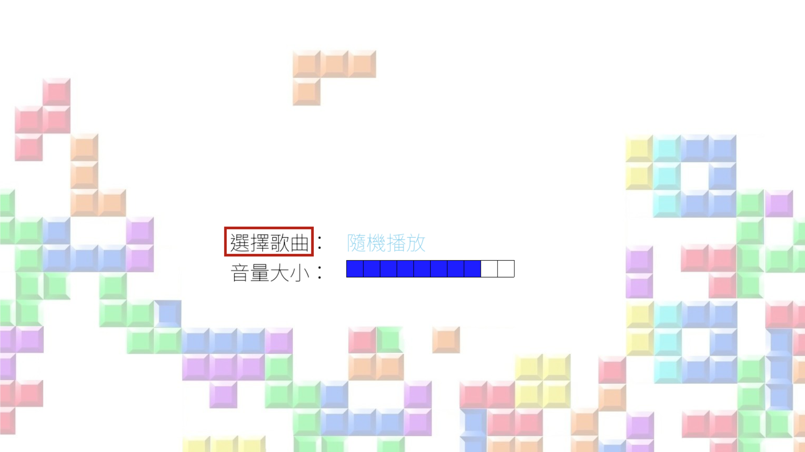
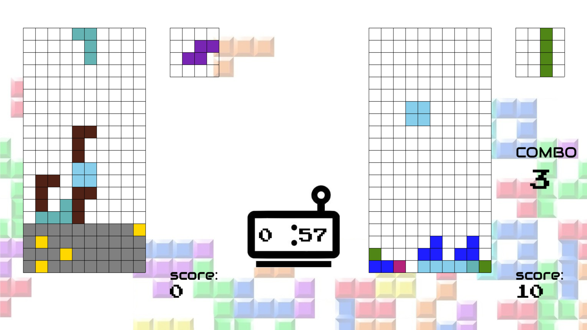
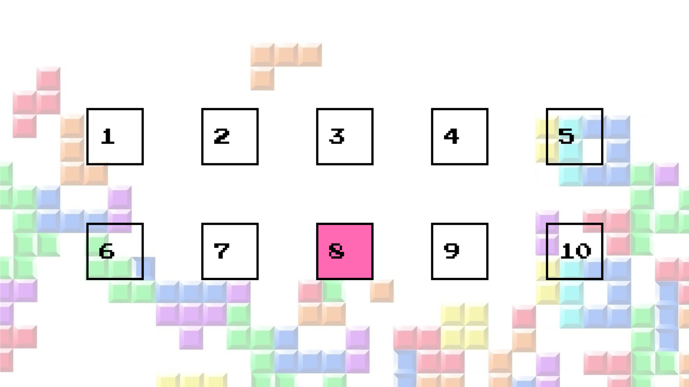
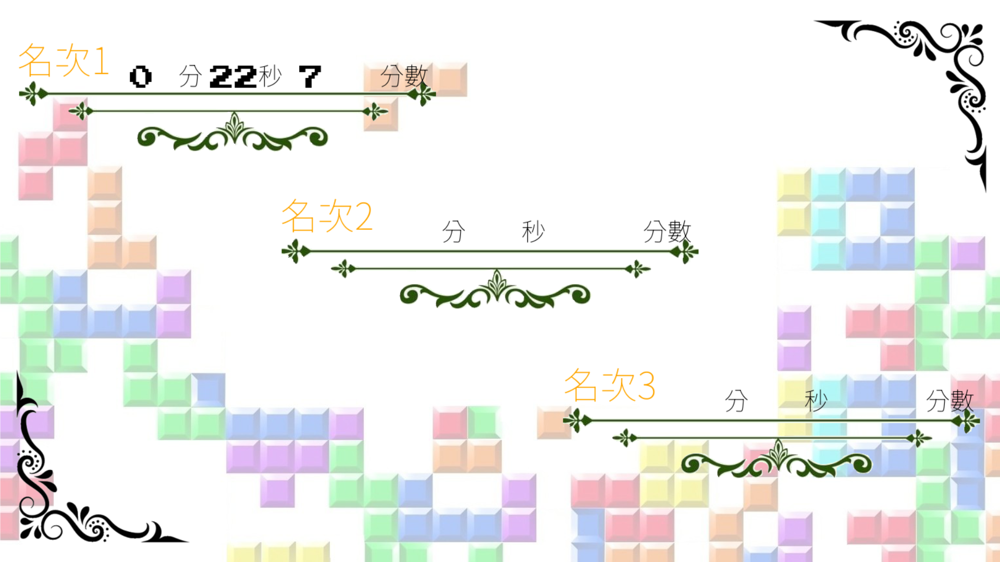

# 俄羅斯方塊（Tetris）遊戲專案

此專題為作者於自學 **Python 與 Pygame** 時所開發的一個完整 Tetris 遊戲。
專案重點在 **遊戲機制** 與 **系統化設計**，主要特色如下：

- 單人、雙人（同機）、無盡三種遊戲模式
- 對戰攻擊 / 垃圾列系統（含地雷、KO 判定）
- 等級（難度）管理：依分數或時間改變下落速度與垃圾行為
- 模組化資源管理：Layout、Screen、Font、Song
- 遊戲資料持久化：排行榜、選曲、音量設定儲存為 JSON
- 除錯輸出工具（dbg）、頁面導覽堆疊（Stack）

> 📌 除了完整遊戲，本 repo 亦保留部分學習練習檔（與主專題無關）。

---

## 📂 目錄結構（主要檔案 / 模組概覽）

```text

core/
├── base/                # Stack、ClockTimer、全域工具
├── debug/               # dbg：開發用除錯輸出工具
├── font/                # 字型 JSON 載入與渲染、文字管理
├── hmi/                 # SONG、RANK、BaseManager（狀態/介面抽象）
├── keyboard/            # 鍵盤輸入映射、游標 hook 管理
├── location_layout/     # 版面配置（LayoutManager、LayoutItem）
├── page/                # 頁面管理、導航與 boot 流程
├── screen/              # 螢幕初始化、背景與圖片管理、繪圖管理
├── tetris_game/         # 遊戲核心（Tetromino, Field, TetrisCore, Attack, Level, Mode）
│   ├── attack/          # 對戰系統（Attack, BattleManager）
│   ├── level/           # 等級/難度管理
│   └── mode/            # single/double/endless 三種模式邏輯
├── variable.py          # 全域路徑、顏色、PageTable、JsonPath 等
Tetris.py                # 遊戲啟動與主迴圈（exe 起點）
Tetris.exe               # 已打包為可執行檔

```


# 🎮 主要功能

## 單人模式
- 可依照自身程度選擇難度，算是熱身環節

## 雙人同機對戰
- 兩位玩家各自操作，落地與連擊會產生攻擊值。
- 攻擊差由系統自動轉換成垃圾列。
- **KO**：當玩家頂端遭到堵塞時會被擊敗一次，當被擊敗三次時，判斷為該玩家失敗並結束遊戲。
- **攻擊機制**：當連續消除方塊或同時多消時會觸發攻擊，此攻擊會增加對方的垃圾列
- **地雷機制**：垃圾列並不是無法移除，將方塊放置在垃圾列中其中一個地雷上會觸發消除整列垃圾方塊

## 無盡模式
- 隨著分數分數增加，難度會隨著增長，可一次體驗單人模式的地一道第十關，適合長時間挑戰。

## 方塊控制
- **移動**：`←` `→`
- **旋轉**：`↑`
- **加速下落**：`↓`
- **立即落下**：`Space`
- **儲存方塊 (Hold)**：`LCtrl`
> 雙人模式的各自操作已經在遊戲中遊戲說明的部分解釋了

---

# ⌨️ 操作說明（預設鍵位）
- `← / → / ↓ / ↑ `：移動當前選項
- `BackSpace`：退回上一頁
- `Enter`：確認 / 前進

---

# 🚀 如何執行
1. 直接執行可執行檔（推薦）
進入 Tetris_program-exe 資料夾
雙擊 Tetris.exe 執行（Windows）

2. 以原始碼執行（開發者）
安裝相依套件 `pip install pygame`
並在**Tetris_program-exe**專案根目錄執行 `python Tetris.py`

---

# ⚙️ 程式設計重點
- 方塊與碰撞
方塊以 4×4 模板定義，每次旋轉只改變 rotation index。

碰撞檢查遍歷 4×4 格子，檢查邊界與場地佔用。

- 旋轉（Wall-kick）
碰撞時嘗試左右位移，若仍衝突則回滾旋轉。

- 消行與分數
Field.clear_lines() 掃描滿行 → 消除 → 補空行 → 回傳行數。

- 分數依 消行數 + combo 加權計算。

- 對戰系統
消行或 combo 產生攻擊 → 攻擊差轉換成垃圾列。

- 垃圾列可含隨機地雷（踩中觸發特殊效果）。

- 等級管理
LevelManager 根據分數或時間提升難度。

- 無盡模式會定時生成垃圾列。

- UI 與版面
LayoutManager 與 LayoutCollection 管理遊戲畫面結構。

DrawManager 將繪圖指令集中處理，分靜態/動態渲染。

---

# 📝 學習與決策重點
- 模組化：畫面、字型、鍵盤、遊戲邏輯分離，方便除錯與擴充。

- 工程實務：資源路徑抽象、JSON 設定與持久化。

- 演算法：碰撞、旋轉、消行、combo、攻擊轉換與垃圾列生成。

- 學習取向：涵蓋遊戲開發常見面向（事件循環、狀態機、資料管理）。


# 📖 參考與除錯
開發環境需安裝 pygame

資源檔案：data/, img/, font/, song/

除錯：dbg.toggle() 開/關 debug 輸出，追蹤函式呼叫與參數


# 🖼️ 截圖展示








